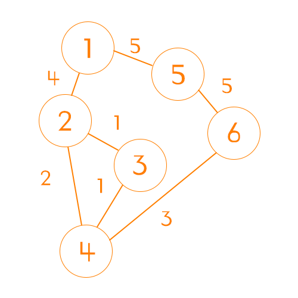

다익스트라(Dijkstra)는 최단 경로 탐색 문제에서 사용되는 알고리즘으로,
특정 노드에서 다른 노드로의 최소 비용을 찾아낼 때 사용하는 알고리즘이다.

알고리즘 분류는 탐욕(Greedy) 알고리즘이라고도 하며,
이미 탐색한 결과에 대해 계산하지 않고, 기존 결과를 재사용한다는 점에서 다이나믹 프로그래밍으로도 볼 수 있다.

노드의 방향이 양방향인지 단방향인지에 상관없이 문제에 적용할 수 있다.

# 흐름
## 노드간 비용 초기화


위와 같은 그래프를 2차원 배열로 초기화 했을 때 아래와 같은 표가 그려진다.

| \ |1|2|3|4|5|6|
|--|--|--|--|--|--|--|
|**1**|0|4|0|0|5|0|
|**2**|4|0|1|2|0|0|
|**3**|0|1|0|1|0|0|
|**4**|0|2|1|0|0|3|
|**5**|5|0|0|0|0|5|
|**6**|0|0|0|3|5|0|

```java
private int[][] initializeGraph(int nodeCount, int[][] nodes) {
    int nodesSize = nodes.length;
    int[][] graph = new int[nodeCount + 1][nodeCount + 1];

    for (int nodeIndex = 1; nodeIndex <= nodesSize; nodeIndex++) {
        int node1 = nodes[nodeIndex][0];
        int node2 = nodes[nodeIndex][1];
        int cost = nodes[nodeIndex][2];

        graph[node1][node2] = cost;
        graph[node2][node1] = cost;
    }

    return graph;
}
```

## 시작점 정하기
이제 시작점을 고르면 된다. 여기서는 시작점을 1로 하겠다.


시작점을 정했다면 그래프에서 해당 시작점의 행을 가져오면 된다.
| \ |1|2|3|4|5|6|
|--|--|--|--|--|--|--|
|**1**|0|4|0|0|5|0|

```java
int[] distance = graph[1].clone();
boolean[] visited = new boolean[n];
```

## 작은 수 부터 방문하기