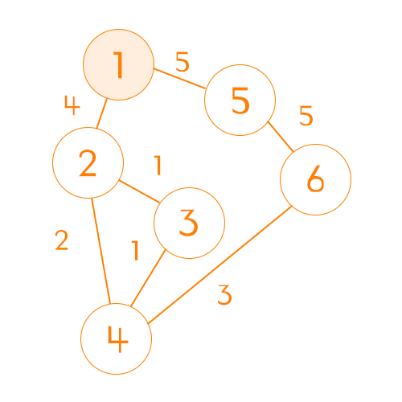
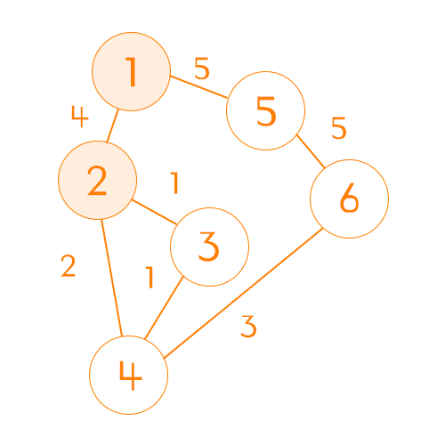
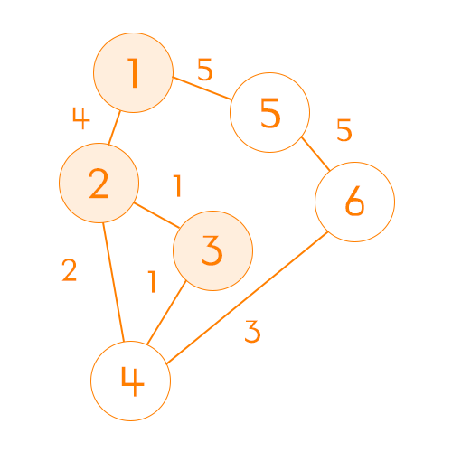
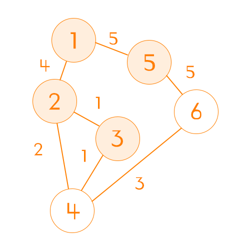
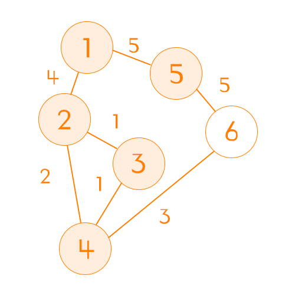
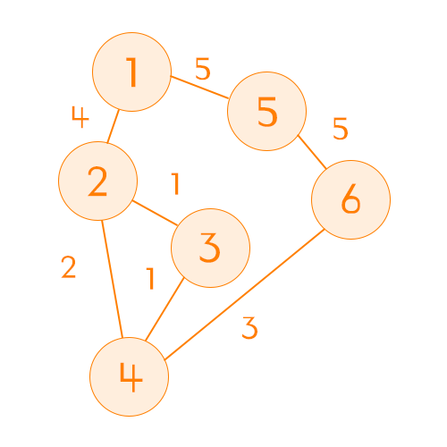

다익스트라(Dijkstra)는 최단 경로 탐색 문제에서 사용되는 알고리즘으로,
특정 노드에서 다른 노드로의 최소 비용을 찾아낼 때 사용하는 알고리즘이다.

알고리즘 분류는 탐욕(Greedy) 알고리즘이라고도 하며,
이미 탐색한 결과에 대해 계산하지 않고, 기존 결과를 재사용한다는 점에서 다이나믹 프로그래밍으로도 볼 수 있다.

노드의 방향이 양방향인지 단방향인지에 상관없이 문제에 적용할 수 있다.

# 흐름

## 노드간 비용 초기화


위와 같은 그래프를 2차원 배열로 초기화 했을 때 아래와 같은 표가 그려진다.

| \        | 1   | 2   | 3   | 4   | 5   | 6   |
| -------- | --- | --- | --- | --- | --- | --- |
| **비용** | 0   | 4   | INF | INF | 5   | INF |
| **2**    | 4   | 0   | 1   | 2   | INF | INF |
| **3**    | INF | 1   | 0   | 1   | INF | INF |
| **4**    | INF | 2   | 1   | 0   | INF | 3   |
| **5**    | 5   | INF | INF | INF | 0   | 5   |
| **6**    | INF | INF | INF | 3   | 5   | 0   |

```java
private int[][] initializeGraph(int nodeCount, int[][] nodes) {
    int nodesSize = nodes.length;
    int[][] graph = new int[nodeCount + 1][nodeCount + 1];

    for (int row = 1; row <= nodeCount; row++) {
        for (int column = 1; column <= n; column++) {
            // 같은 위치 비용 0 처리
            if (row == column) {
                graph[row][column] = 0; // 상수로 포장해 사용해주는 것이 좋다
            }
            // 방문 불가 처리
            graph[row][column] = Integer.MAX_VALUE; // 상수로 포장해 사용해주는 것이 좋다
        }
    }

    for (int nodeIndex = 1; nodeIndex <= nodesSize; nodeIndex++) {
        int node1 = nodes[nodeIndex][0];
        int node2 = nodes[nodeIndex][1];
        int cost = nodes[nodeIndex][2];

        graph[node1][node2] = cost;
        graph[node2][node1] = cost;
    }

    return graph;
}
```

## 시작점 정하기

이제 시작점을 고르면 된다. 여기서는 시작 노드를 1로 하겠다.


시작 노드를 정했다면 그래프에서 해당 시작점의 행을 가져오면 된다.
| \ |1|2|3|4|5|6|
|--|--|--|--|--|--|--|
|**비용**|0|4|INF|INF|5|INF|

```java
int[] distance = graph[1].clone();
boolean[] visited = new boolean[n];
```

## 비용이 작은 노드 부터 방문하기

|      \       |  1  |  2  |  3  |  4  |  5  |  6  |
| :----------: | :-: | :-: | :-: | :-: | :-: | :-: |
| **업데이트** |     | 🌟  |     |     | 🌟  |     |
|   **비용**   |  0  |  4  | INF | INF |  5  | INF |
| **방문여부** | ✅  | ❌  | ❌  | ❌  | ❌  | ❌  |

1. 방문하지 않았으면서, 비용이 **가장 작은** 노드를 먼저 찾는다.

   > 위 상황에서는 비용이 4인 2번 노드가 된다.

2. 1번에서 찾은 노드의 다음 노드를 찾는다.

   > 2번 노드의 다음 노드는 1, 3, 4번 노드이다.

3. 방문했던 노드를 제외한 노드들의 비용과 현재 노드의 비용을 합한다.

   > 2번 노드의 비용이 4이므로
   > 3번 노드는 총 비용이 5
   > 4번 노드는 총 비용이 6

4. 시작 노드에서 해당 노드들의 방문 비용을 비교해서 업데이트 한다.
   > 1번 노드에서 3번 노드로 가는 비용은 0으로 아직 방법이 없다.
   > 1번 노드에서 4번 노드로 가는 비용은 0으로 아직 방법이 없다.
   > 결론적으로 1번 노드에서 3번 노드와 4번노드를 가는 비용을 업데이트 한다.



|      \       |  1  |  2  |  3  |  4  |  5  |  6  |
| :----------: | :-: | :-: | :-: | :-: | :-: | :-: |
| **업데이트** |     |     | 🌟  | 🌟  |     |     |
|   **비용**   |  0  |  4  |  5  |  6  |  5  | INF |
| **방문여부** | ✅  | ✅  | ❌  | ❌  | ❌  | ❌  |

## 반복

모든 노드를 방문할 때까지 또는 원하는 노드를 방문할 때 까지 위 과정을 반복하면 된다.
여기서는 모든 노드의 경로를 찾을 때 까지 반복하겠다.

```java
private int findMinNode(int n, int[] distance, boolean[] visited) {
    int minNode = -1;
    int minValue = Integer.MAX_VALUE;

    for (int i = 1; i <= n; i++) {
        if (visited[i] ||
        distance[i] >= Integer.MAX_VALUE) {
            continue;
        }

        minNode = i;
        minValue = distance[i];
    }

    return minNode;
}

private void dijikstra(int n, int[][] graph) {
    int[] distance = new int[nodeCount]; // 시작 지점의 다음 노드별 비용 리스트
    int node = n;

    boolean[] visited = new boolean[n + 1];

    while (node > -1) {
        visited[node] = true;

        for (int nextNode = 1; nextNode <= nodeCount; nextNode++) {
            int newDistance = distance[node] + graph[node][nextNode];

            if (visited[nextNode] ||
            distance[nextNode] <= newDistance) {
                continue;
            }

            distance[nextNode] = newDistance;
        }

        node = findMinNode(n, distance, visited);
    }

    return distance;
}
```



|      \       |  1  |  2  |  3  |  4  |  5  |  6  |
| :----------: | :-: | :-: | :-: | :-: | :-: | :-: |
| **업데이트** |     |     |     |     |     |     |
|   **비용**   |  0  |  4  |  5  |  6  |  5  | INF |
| **방문여부** | ✅  | ✅  | ✅  | ❌  | ❌  | ❌  |

> 여기서 3번과 5번이 똑같이 5라는 비용인데 3번을 먼저 간 이유는
> 반복문을 통해 작은 수부터 검사했기 때문이다.
> 이 순서는 크게 중요하지 않다.



|      \       |  1  |  2  |  3  |  4  |  5  |  6  |
| :----------: | :-: | :-: | :-: | :-: | :-: | :-: |
| **업데이트** |     |     |     |     |     | 🌟  |
|   **비용**   |  0  |  4  |  5  |  6  |  5  | 10  |
| **방문여부** | ✅  | ✅  | ✅  | ❌  | ✅  | ❌  |



|      \       |  1  |  2  |  3  |  4  |  5  |  6  |
| :----------: | :-: | :-: | :-: | :-: | :-: | :-: |
| **업데이트** |     |     |     |     |     | 🌟  |
|   **비용**   |  0  |  4  |  5  |  6  |  5  |  9  |
| **방문여부** | ✅  | ✅  | ✅  | ✅  | ✅  | ❌  |



|      \       |  1  |  2  |  3  |  4  |  5  |  6  |
| :----------: | :-: | :-: | :-: | :-: | :-: | :-: |
| **업데이트** |     |     |     |     |     |     |
|   **비용**   |  0  |  4  |  5  |  6  |  5  |  9  |
| **방문여부** | ✅  | ✅  | ✅  | ✅  | ✅  | ✅  |

> 마지막 남은 한 개의 노드는 굳이 방문하지 않아도 된다.
> 마지막 노드에서 경유해서 갈 다른 노드는 이미 모두 방문했기 때문

### 여기서 궁금했던 점

나는 여기서 "이미 방문했던 노드의 비용을 업데이트하지 않아도 되는 것인가?" 라는 생각이 들었다.
하지만 다익스트라에선 가장 적은 비용의 노드부터 방문한다는 점에서 이러한 걱정을 할 필요가 없았다.

> 가령 1번 노드에서 2번 노드와 3번 노드를 갈 수 있다고 가정했을 때,
> 2번 노드에 가는 비용이 3이고, 3번 노드에 가는 비용이 4라고 하자.
> 3번 노드로 가는 경우 어떻게 해서도 2번 노드의 비용보다 적을 수 없다.

# 확장성

1. distance 배열에서 가장 작은 값을 먼저 처리한다는 점에서 우선순위 큐(Priority Queue)를 적용하면 효율을 더 챙길 수 있을 것이다.
2. for문으로 검사중인 노드의 다음 노드들을 확인하는데, 이때 for문으로 모든 노드를 확인하지 않고 Map이나 List를 사용하여 방문 가능한 노드들만 확인할 수 있다.
3. 만약 node의 수가 많다면 int[][]와 같은 배열이 아닌 List를 사용해 메모리를 줄일 수 있다.

# 결론

기존의 DFS, BFS 방식으로 노드 문제를 많이 해결했었는데,
노드 문제들을 만날수록 고려해야하는 노드들이 많아지고,
시간을 초과하는 일이 빈번해지기에 다익스트라를 통해 이런 문제들을 해결할 수 있었다.

처음 다익스트라 알고리즘을 접했을 때는 정말 이렇게 풀면 효율적으로 풀 수 있는 건가? 생각했다.
실제로 코드를 작성하고, 노드의 흐름을 확인해봤을 때는 이해할 수 있었다.

```java
public int getMinDistance(int start, int end, int nodeCount, int[][] nodes) {
    int[][] graph = initializeGraph(nodeCount, nodes);
    int[] distance = dijkstra(nodeCount, graph);

    return distance[end];
}

private int[][] initializeGraph(int nodeCount, int[][] nodes) {
    int nodesSize = nodes.length;
    int[][] graph = new int[nodeCount + 1][nodeCount + 1];

    for (int row = 1; row <= nodeCount; row++) {
        for (int column = 1; column <= n; column++) {
            // 같은 위치 비용 0 처리
            if (row == column) {
                graph[row][column] = 0; // 상수로 포장해 사용해주는 것이 좋다
            }
            // 방문 불가 처리
            graph[row][column] = Integer.MAX_VALUE; // 상수로 포장해 사용해주는 것이 좋다
        }
    }

    for (int nodeIndex = 1; nodeIndex <= nodesSize; nodeIndex++) {
        int node1 = nodes[nodeIndex][0];
        int node2 = nodes[nodeIndex][1];
        int cost = nodes[nodeIndex][2];

        graph[node1][node2] = cost;
        graph[node2][node1] = cost;
    }

    return graph;
}

private int findMinNode(int nodeCount, int[] distance, boolean[] visited) {
    int minNode = -1;
    int minValue = Integer.MAX_VALUE;

    for (int i = 1; i <= nodeCount; i++) {
        if (visited[i] ||
        distance[i] >= Integer.MAX_VALUE) {
            continue;
        }

        minNode = i;
        minValue = distance[i];
    }

    return minNode;
}

private void dijikstra(int start, int nodeCount, int[][] graph) {
    int[] distance = new int[nodeCount]; // 시작 지점의 다음 노드별 비용 리스트
    int node = nodeCount;

    boolean[] visited = new boolean[nodeCount + 1];

    while (node > -1) {
        visited[node] = true;

        for (int nextNode = 1; nextNode <= nodeCount; nextNode++) {
            int newDistance = distance[node] + graph[node][nextNode];

            if (visited[nextNode] ||
            distance[nextNode] <= newDistance) {
                continue;
            }

            distance[nextNode] = newDistance;
        }

        node = findMinNode(nodeCount, distance, visited);
    }

    return distance;
}
```
