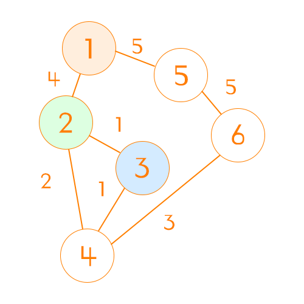
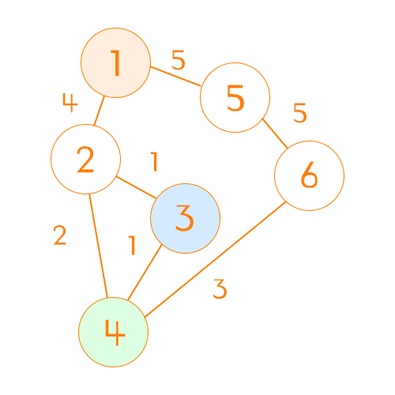

플로이드 워셜(FLoyd Warshall)은 모든 노드의 최단 경로 탐색 문제에서 사용되는 알고리즘으로,
모든 노드로부터 다른 모든 노드로의 최소 비용을 찾아낼 때 사용하는 알고리즘이다.

다익스트라(dijkstra)와 비교할 수 있는데, 다익스트라 알고리즘은 특정 한 노드를 기준으로
다른 노드들로 가는 최소 비용만을 구하지만,
플로이드 워셜은 모든 노드에서 다른 모든 노드들로 가는 최소 비용을 구하기 때문에 더 오래걸린다. (무려 3중첩 for문...ㄷㄷ)

이 알고리즘 또한 다익스트라와 같이 노드의 단방향 양방향에 관계 없이 적용할 수 있다.

# 흐름

## 노드간 비용 초기화


위와 같은 그래프를 2차원 배열로 초기화 했을 때 아래와 같은 표가 그려진다.

|  \    |  1  |  2  |  3  |  4  |  5  |  6  |
| :---: | :-: | :-: | :-: | :-: | :-: | :-: |
| **1** |  0  |  4  | INF | INF |  5  | INF |
| **2** |  4  |  0  |  1  |  2  | INF | INF |
| **3** | INF |  1  |  0  |  1  | INF | INF |
| **4** | INF |  2  |  1  |  0  | INF |  3  |
| **5** |  5  | INF | INF | INF |  0  |  5  |
| **6** | INF | INF | INF |  3  |  5  |  0  |

```java
private int[][] initializeGraph(int n, int nodeCount, int[][] nodes) {
    int nodesSize = nodes.length;
    int[][] graph = new int[nodeCount + 1][nodeCount + 1];

    for (int row = 1; row <= n; row++) {
        for (int column = 1; column <= n; column++) {
            // 같은 위치 비용 0 처리
            if (row == column) {
                graph[row][column] = 0; // 상수로 포장해 사용해주는 것이 좋다
            }
            // 방문 불가 처리
            graph[row][column] = Integer.MAX_VALUE; // 상수로 포장해 사용해주는 것이 좋다
        }
    }

    for (int nodeIndex = 1; nodeIndex <= nodesSize; nodeIndex++) {
        int node1 = nodes[nodeIndex][0];
        int node2 = nodes[nodeIndex][1];
        int cost = nodes[nodeIndex][2];

        graph[node1][node2] = cost;
        graph[node2][node1] = cost;
    }

    return graph;
}
```

## 반복해서 노드 최소비용 업데이트하기

시작 노드와 중간 노드, 끝 노드를 각 for문으로 작성하여,
시작 노드에서 중간 노드를 거쳐 끝 노드까지 가는 최소 비용을 찾아낸다.

```java
private void floydwarshall(int nodeCount, int[][] graph) {
    for (int middleNode = 0; middleNode < nodeCount; middleNode++) {
        for (int startNode = 0; startNode < nodeCount; startNode++) {
            for (int endNode = 0; endNode < nodeCount; endNode++) {
                int newDistance = graph[startNode][middleNode] + graph[middleNode][endNode];

                if (graph[startNode][endNode] > newDistance) {
                    graph[startNode][endNode] = newDistance;
                    graph[endNode][startNode] = newDistance;
                }
            }
        }
    }

    // graph에 직접적으로 수정하므로 return은 X
}
```

### 예시

아래 사진과 같이 middleNode가 2이고 startNode가 1, endNode가 3일 때
즉, 1에서 2를 거쳐 3을 가는 상황일 때
현재 1에서 3을 갈 때 필요한 비용(INF)과,
1에서 2를 가는 비용 + 2에서 3을 가는 비용(5)을 더한 값을 비교하여 값을 업데이트 한다.

1에서 3을 가는 비용이 INF기 때문에 새롭게 업데이트 해준다.
| \ | 1 | 2 | 3 | 4 | 5 | 6 |
| :--------: | :---: | :---: | :---: | :---: | :---: | :---: |
| **1** | 0 | 4 | 5🌟 | INF | 5 | INF |
| **2** | 4 | 0 | 1 | 2 | INF | INF |
| **3** | 5🌟 | 1 | 0 | 1 | INF | INF |
| **4** | INF | 2 | 1 | 0 | INF | 3 |
| **5** | 5 | INF | INF | INF | 0 | 5 |
| **6** | INF | INF | INF | 3 | 5 | 0 |



이제 for문이 계속해서 돌아 middleNode가 4, startNode는 1, endNode 3일 때를 처리한다고 생각해보자.
그럼 직전까지 수정한 배열의 상태는 아래와 같아진다

startNode인 1에서 endNode 노드로 가는 비용은 6으로 업데이트 되었다.
여기서 코드는 비용 6과
startNode(1) -> middleNode(3) = 5

- middleNode(3) -> endNode(4) = 1

를 비교했을 때 6으로 값이 같기 때문에 업데이트 하지 않는다.
만약 2 -> 4 비용이 3이었다면, 방금 과정에서 6으로 새롭게 업데이트 했을 것이다.

|  \    |  1  |  2  |  3  |  4  |  5  |  6  |
| :---: | :-: | :-: | :-: | :-: | :-: | :-: |
| **1** |  0  |  4  |  5  |  6  |  5  | INF |
| **2** |  4  |  0  |  1  |  2  | INF | INF |
| **3** |  5  |  1  |  0  |  1  | INF | INF |
| **4** |  6  |  2  |  1  |  0  | INF |  3  |
| **5** |  5  | INF | INF | INF |  0  |  5  |
| **6** | INF | INF | INF |  3  |  5  |  0  |



# 결론

알고리즘이 생각보다 단순해서 금방 익힐 수 있었다. 단 for문 3줄이면 된다니..
문제의 조건에 따라 플로이드 워셜 알고리즘과 다익스트라 알고리즘을 판단해서 사용하면 좋을 것 같다.

오늘 합승 택시 요금 문제를 이 플로이드 워셜 알고리즘으로 풀었는데, 3단계임에도 정말 간단하게 풀 수 있었다.

```java
public int[][] solution(int nodeCount, int[][] nodes) {
    int[][] graph = initializeGraph(nodeCount, nodes);
    floydWarshall(nodeCount, graph);

    return graph;
}

private int[][] initializeGraph(int nodeCount, int[][] nodes) {
    int nodesSize = nodes.length;
    int[][] graph = new int[nodeCount + 1][nodeCount + 1];

    for (int row = 1; row <= nodeCount; row++) {
        for (int column = 1; column <= n; column++) {
            // 같은 위치 비용 0 처리
            if (row == column) {
                graph[row][column] = 0; // 상수로 포장해 사용해주는 것이 좋다
            }
            // 방문 불가 처리
            graph[row][column] = Integer.MAX_VALUE; // 상수로 포장해 사용해주는 것이 좋다
        }
    }

    for (int nodeIndex = 1; nodeIndex <= nodesSize; nodeIndex++) {
        int node1 = nodes[nodeIndex][0];
        int node2 = nodes[nodeIndex][1];
        int cost = nodes[nodeIndex][2];

        graph[node1][node2] = cost;
        graph[node2][node1] = cost;
    }

    return graph;
}

private void floydWarshall(int nodeCount, int[][] graph) {
    for (int middleNode = 0; middleNode < nodeCount; middleNode++) {
        for (int startNode = 0; startNode < nodeCount; startNode++) {
            for (int endNode = 0; endNode < nodeCount; endNode++) {
                int newDistance = graph[startNode][middleNode] + graph[middleNode][endNode];

                if (graph[startNode][endNode] > newDistance) {
                    graph[startNode][endNode] = newDistance;
                    graph[endNode][startNode] = newDistance;
                }
            }
        }
    }

    // graph에 직접적으로 수정하므로 return은 X
}
```
