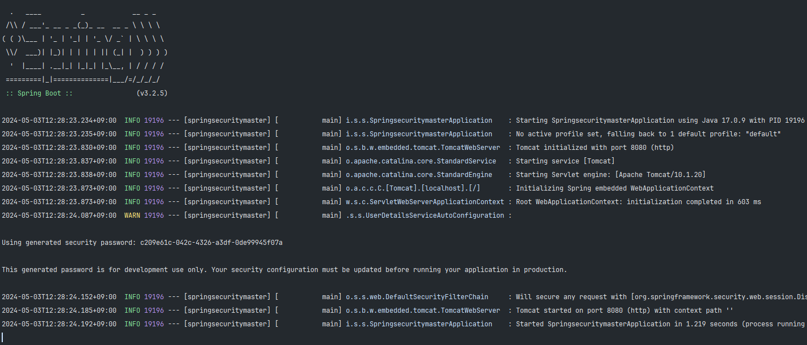
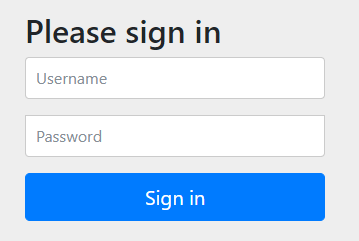

스프링 부트에서 제공되는 기본 인증 방식에 대해 알아볼 것이다.  
웹사이트에 접근할 때, 어떤 경로에 접근하느냐에 따라 접근이 허용되는 경로와 허용되지 않는 경로가 있기 마련이다.  
이러한 접근 보안에 대해 알아볼 것이다.

## 스프링 시큐리티 기본 개념

### SecurityBuilder

빌더 클래스로서 웹 보안을 구성하는 `빈 객체`와 `설정 클래스`들을 생성하는 역할을 한다.  
대표적으로 `WebSecurity`, `HttpSecurity`가 있다.

### SecurityConfigurer

Http 요청과 관련된 보안 처리를 담당하는 `필터`들을 생성하고 여러 초기화 설정에 관여한다.<br>
이 `SecurityConfigurer`는 `SecurityBuilder`에 참조되며, 인증 및 인가 초기화 작업은 `SecurityConfigurer`에서 진행된다.

### 초기화 흐름

#### 1. 빌더 클래스 생성

##### 흐름

`AutoConfiguration` -> `build()` -> `SecurityBuilder`

##### 작동

`SecurityBuilder`를 통해 `HttpSecurity` 생성 후 Bean 등록

#### 2. 설정 클래스 생성

##### 흐름

`SecurityBuilder` -> `SecurityConfigurer`

##### 작동

1번에서 `HttpSecurity`가 생성되어 빈으로 등록되면, `SecurityConfigurer` 객체들을 자동으로 생성한다.

> 이렇게 생성된 SecurityConfigurer 객체는 init과 configure 메소드를 가진다.
> 이때, 인자는 Builder 클래스인 HttpSecurity

#### 3. 초기화 작업 진행

##### 흐름

`SecurityBuilder` -> `init(B builder)` / `configure(B builder)` -> `SecurityConfigurer`

##### 작동

2번에서 생성한 `설정 클래스`들의 메소드(`init`, `configure`)에 빌더 클래스를 인자로 전달<br>

> 이 과정에서 필터가 생성된다.
> 각 configurer은 하나의 필터를 가진다.

## 스프링 시큐리티 기본 인증

스프링 시큐리티에서는 기본적으로 제공하는 로그인 인증 방식이 존재한다.<br>
하나의 계정을 기본적으로 제공해주며, 인증 설정에 따라 특정 페이지에 접근 시 이 로그인 과정이 필요하다.

### 기본 제공 계정

기본적으로 제공해주는 계정의 아이디는 `user` 이다.<br>
암호는 랜덤으로 생성되는 UUID 인데, 서버가 실행될 때 콘솔창에 나타난다.

```
id: user<br>
pw: 랜덤 UUID
```

### 프로젝트 실행 (암호 생성)

프로젝트를 실행하면 아래 이미지와 같이 하나의 암호가 생성된 것을 볼 수 있다.<br>
이 암호는 위에서 설명한 것과 같이 처음 제공되는 계정의 비밀번호이다.<br>

> 암호는 프로젝트의 매 실행마다 바뀐다.



서버의 컨트롤러에 정의한 특정 경로를 타고 들어가게되면, 아래와 같이 Spring Security에서 제공되는 로그인 폼이 렌더링된다.<br>



`Username`에는 Spring Security에서 처음 제공해주는 `user`를 입력하고,<br>
`Password`에는 프로젝트 실행 시 제공받은 키를 입력하자.

> 위 내용에 따르면 Password는 c209e61c-042c-4326-a3df-0de99945f07a 이다.

결론적으로 인증이 성공하여 접근하려고 했던 경로의 페이지가 반환된다.

## 기본 인증 설정

### 요청 별 인증 설정

`SpringBootWebSecurityConfiguration.java` 클래스의<br>
`defaultSecurityFilterChain` 메소드를 통해<br>
`SecurityFilterChain`이 빈으로 등록되는 것이 시작이다.<br>

간단히 얘기하면, `defaultSecurityFilterChain` 메소드는 앞에서 초기화 한 `HttpSecurity` 빈 객체를 인자로 받아와서,<br>
`HttpSecurity` 빈 객체에 보안 설정을 적용한 후, `SecurityFilterChain`으로 변환하고, 이 필터체인을 빈으로 등록하여,<br>
<u>요청이 들어왔을 때 이 `SecurityFilterChain`을 통해 각 요청에 맞는 실제 보안이 적용되도록 하는 것이다.</u>

> 요청이 들어왔을 때, `SecurityFilterChain`에서 해당 요청에 맞는 `Configurer` 객체를 찾아,
> 해당 `Configurer`에 정의된 설정대로 보안 처리가 이루어진다.

`http.authorizeHttpRequests((requests) -> requests.anyRequest().authenticated());`<br>
이 코드를 예시로 보았을 때, `authorizeHttpRequests`는 `http`로 들어온 `요청`의 `인증`을 설정한다는 의미이며,<br>
`request.anyRequest()`는 들어온 모든 요청을 의미, `.authenticated()`는 인증이 필요하다는 것을 의미한다.<br>

즉 아래 코드에서는 들어온 모든 경로의 요청에 인증을 필요로 하고있다.

```java
@Configuration(proxyBeanMethods = false)
@ConditionalOnDefaultWebSecurity
static class SecurityFilterChainConfiguration {

    @Bean
    @Order(SecurityProperties.BASIC_AUTH_ORDER)
    SecurityFilterChain defaultSecurityFilterChain(HttpSecurity http) throws Exception {
        http.authorizeHttpRequests((requests) -> requests.anyRequest().authenticated());
        http.formLogin(withDefaults());
        http.httpBasic(withDefaults());
        return http.build();
    }

}
```

하지만 `defaultSecurityFilterChain` 메소드가 실행되어 `SecurityFilterChain`을 빈으로 등록하기 위한 조건이 별도로 존재하며,<br>
바로 `@ConditionalOnDefaultWebSecurity` 어노테이션을 통해 이 조건을 알 수 있다.<br>

```java
@Target({ ElementType.TYPE, ElementType.METHOD })
@Retention(RetentionPolicy.RUNTIME)
@Documented
@Conditional(DefaultWebSecurityCondition.class)
public @interface ConditionalOnDefaultWebSecurity {

}
```

이 어노테이션 안에도 `@Conditional`이라는 어노테이션이 존재하는데,<br>
이 안의 `DefaultWebSecurityCondition.class`를 들어가서 확인해보면,<br>
각 `@ConditionalOnClass`와 `@ConditionalOnMissingBean`를 사용하는 클래스들의 조건이 충족되어야 한다.<br>

#### 조건1

`SecurityFilterChain.class` 및 `HttpSecurity.class` 클래스가 Class Path에 존재하느냐?<br>

> 스프링 시큐리티 의존성을 추가했다면 존재한다고 볼 수 있다.

#### 조건2

`SecurityFilterChain.class` 빈이 생성되어 있지 않은가?

> 별도로 SecurityFilterChain.class 빈을 생성한 코드를 작성하지 않았다면,
> 아직 생성되지 않은 상태이다.

```java
class DefaultWebSecurityCondition extends AllNestedConditions {

	DefaultWebSecurityCondition() {
		super(ConfigurationPhase.REGISTER_BEAN);
	}

	@ConditionalOnClass({ SecurityFilterChain.class, HttpSecurity.class }) // 조건 1
	static class Classes {

	}

	@ConditionalOnMissingBean({ SecurityFilterChain.class }) // 조건 2
	static class Beans {

	}

}
```

### 인증 사용자

`SecurityProperties.java` 클래스는 앞서 진행한 로그인과 관련된 내용을 설정하는 클래스이다.<br>
클래스에 내장된 `User` 클래스를 확인하면,<br>
`name`은 기본적으로 제공되는 `user`이며, `password`는 랜덤한 `UUID`로 되어있는 것을 확인할 수 있다.

```java
public static class User {

    /**
     * Default user name.
     */
    private String name = "user";

    /**
     * Password for the default user name.
     */
    private String password = UUID.randomUUID().toString();

    /**
     * Granted roles for the default user name.
     */
    private List<String> roles = new ArrayList<>();

    private boolean passwordGenerated = true;

    public String getName() {
        return this.name;
    }

    public void setName(String name) {
        this.name = name;
    }

    public String getPassword() {
        return this.password;
    }

    public void setPassword(String password) {
        if (!StringUtils.hasLength(password)) {
            return;
        }
        this.passwordGenerated = false;
        this.password = password;
    }

    public List<String> getRoles() {
        return this.roles;
    }

    public void setRoles(List<String> roles) {
        this.roles = new ArrayList<>(roles);
    }

    public boolean isPasswordGenerated() {
        return this.passwordGenerated;
    }

}
```

### DB 연동 없이 어떻게 비교하는가?

지금까지 DB연동도 없이 어떻게 인증이 이루어지는지 궁금했다.<br>
`Spring Security`는 새로운 유저가 발생했을 때, `메모리`에 저장하는 과정을 거친다.<br>
`SecurityProperties` 클래스의 `User` 또한 프로젝트가 실행하면서 메모리에 저장되고,<br>
로그인을 시도할 때, 메모리의 데이터와 비교하여 인증이 가능한 것이다.

#### 그렇다면 초기 계정은 어떻게 메모리에 저장되는가?

`UserDetailsServiceAutoConfiguration` 클래스를 확인하면 알 수 있다.

```java
@Bean
public InMemoryUserDetailsManager inMemoryUserDetailsManager(SecurityProperties properties,
        ObjectProvider<PasswordEncoder> passwordEncoder) {
    SecurityProperties.User user = properties.getUser();
    List<String> roles = user.getRoles();
    return new InMemoryUserDetailsManager(User.withUsername(user.getName())
        .password(getOrDeducePassword(user, passwordEncoder.getIfAvailable()))
        .roles(StringUtils.toStringArray(roles))
        .build());
}
```

`SecurityProperties` 클래스에 내장된 `User` 클래스를 가져온 뒤,<br>
`getName()`과 `getPassword()` 및 `getRoles()`를 사용하여<br>
이 `User`의 정보를 담은 `InMemoryUserDetailsManager` 클래스를 초기화하고,<br>
이 클래스가 빈으로 등록되면서 스프링 컨테이너에 의해 관리되는 형식이다.

> 추가되는 User들도 이 InMemoryUserDetailsManager에 등록된다.
