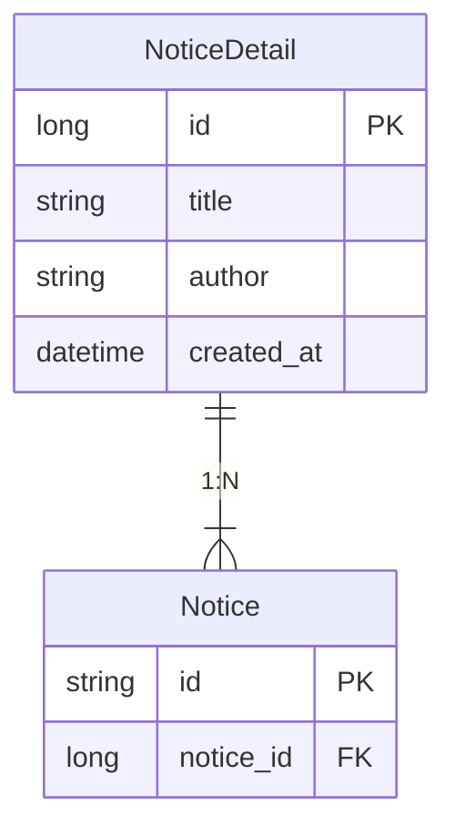

공지사항을 개발하던 도중 복합키를 사용하게 되었다.  
단순히 @Id를 두 번 넣으면 되겠지라고 생각했던 것은 오산이었다.

```java
public class Notice {

    @Id
    private String department;

    @Id // 오류 발생
    private NoticeDetail noticeId;
}
```

## 왜 문제인가?

아래 사진을 확인하면 `Entity has more than one id attribute.`라는 문구를 출력한다.  
이 의미는 한 개 보다 많은 id 속성을 가진다고 경고하는 것이다.


@Id를 두 번 사용하는 것은 어떤 문제가 있을까?  
아래 사이트를 통해 확인해봤다.

> https://www.baeldung.com/jpa-composite-primary-keys

`@Id` 어노테이션에 대한 중복 사용은 지원되지 않는 것으로 확인된다.  
그렇다고 복합키를 사용할 수 없는 것은 아니며, 제공되는 방식으로 복합키를 구현해야 했다.  
이는 2가지로, 아래와 같다.

1. `@IdClass(Key.class)`
2. `Embeddable`

## @IdClass

먼저 @IdClass에 대한 사용 방법을 알아보자.

```java
@Entity
@IdClass(NoticeKey.class)
public class Notice {

    @Id
    private String department;

    @Id
    private NoticeDetail noticeDetail;
}

public class NoticeKey implements Serializable {

    private String department;

    private NoticeDetail noticeDetail;

    @Override
    public boolean equals(Object o) {
        ...
    }

    @Override
    public int hashCode() {
        return Objects.hash(department, noticeDetails);
    }
}
```

코드는 위처럼 복합키에 대한 새로운 class를 만들고,  
이를 entity에 `@IdClass(key.class)` 방식으로 매핑해주는 것이다.
여기서 Key에 대한 class는 `Serializable`의 구현체여야 한다.

이는 직관적으로 entity 객체에 어떤 값이 키로 관리되는지 확인할 수 있다는 장점이 있다.

## @Embeddable

Embeddable 코드를 확인해보자.

```java
@Entity
public class Notice {

    @Id @EmbeddedId
    private NoticeKey id;
}

@Embeddable
public class NoticeKey implements Serializable {

    private String department;

    private NoticeDetail noticeDetail;

    @Override
    public boolean equals(Object o) {
        ...
    }

    @Override
    public int hashCode() {
        return Objects.hash(department, noticeDetails);
    }
}
```

@IdClass와 달라진 점은 똑같은 키를 그대로 entity에 작성하는 것이 아니라,  
Key 클래스 자체를 id로 주는 방식이다.

이렇게 작성했을 때 NoticeKey를 한 번 더 확인해야  
실제로 어떤 값이 키가 되는지 확인할 수 있다는 단점이 있다.

@IdClass 방식과 마찬가지로 `Serializable`의 구현체여야 한다.

## 그래서 @IdClass와 @Embeddable의 차이점은?

### JPQL

JPQL에서도 큰 차이를 보인다.  
아래는 공지 상세 id를 가진 행들을 가져오는 예시이다.

```java
// @Embeddable
class interface NoticeRepository extends JpaRepository<Notice, Long> {
    @Query("SELECT * FROM Notice n WHERE n.id.noticeDetail.id = :noticeId")
    List<Notice> findById(Long noticeId);
}

// @IdClass
class interface NoticeRepository extends JpaRepository<Notice, Long> {
    @Query("SELECT * FROM Notice n WHERE n.noticeDetail.id = :noticeId")
    List<Notice> findById(Long noticeId);
}
```

위 코드에서 다른 점은 WHERE절에서 확인할 수 있다.  
Embeddable은 Key에 대한 class 자체로 관리되기 때문에  
`.id`로 `NoticeKey` 키 인스턴스를 가져오고, `noticeDetail`을 불러온 다음 `id`를 확인한다.

반면에 IdClass 방식은 `NoticeKey` 인스턴스를 바로 가져와서 `id`를 확인한다.  
만약 속성 이름이 길어진다면 `n.id.noticeDetail.id`보다 더 길어질 수도 있다.  
이러한 점에서 Embeddable이 불리하다.

### 키 수정

개발 과정에서 자주는 아니지만 일어날 수 있는 시나리오 중 키가 변경되는 경우가 발생할 수 있다.  
이 경우 @IdClass 방식에서는 entity와 Key 클래스 모두 변경해주어야 한다는 단점이 발생한다.

```java
@Entity
@IdClass(NoticeKey.class)
public class Notice {

    @Id
    private String department;

    @Id
    private NoticeDetail noticeDetail;

    // 추가
}

public class NoticeKey implements Serializable {

    private String department;

    private NoticeDetail noticeDetail;  // 수정

    // 추가

    ...
```

반대로 @Embeddable 방식은 Key 클래스만 수정해주면 된다.

```java
@Entity
public class Notice {

    @Id @EmbeddedId
    private NoticeKey id;
}

@Embeddable
public class NoticeKey implements Serializable {

    private String department;

    private NoticeDetail noticeDetail; // 클래스 수정

    // 새 값 추가

    ...
}
```

위와 같은 경우 Embeddable 방식이 더 낫다고 볼 수 있다.

## 뜻밖의 Serializable 이슈

무작정 블로그들을 찾아보고 구현했을 때는 Key 클래스에 대해 `Serializable`를 구현하는 구조가 아닌  
`equals` 메서드와 `hashCode` 메서드만 구현하고 끝냈다.  
아무 문제 없이 실행이 됐지만, 이 글을 쓰기 위해 자료를 찾아보면서  
모든 entity가 Serializable을 구현하는 구조가 JPA 표준이라는 사실을 알았다.

이 말을 다시 얘기한다면 entity는 직렬화가 가능해야 한다는 점이다.  
또한 복합키도 직렬화가 가능해야 한다.

> https://www.baeldung.com/jpa-entities-serializable

여기서 진짜 문제는 Serializable을 구현하지 않아도 잘 작동한다는 점이다.  
Serializable을 쓰고 안 쓰고의 차이는 무엇일까?

### Serializable의 역할

Java 객체를 Byte 스트림으로 변환하는 프로세스이다.  
JPA의 Hibernate는 이렇게 entity 객체를 직렬화한다.

그러면 직렬화는 왜 하는 것일까?  
entity를 프레젠테이션 계층에 직접 노출할 때 필요하다고 한다. (JVM 외부로)

이 의미는 Http Request에 대해 Response에 담을 수 있느냐 없느냐에 대한 얘기는 아니다.
REST API 환경에서는 Jackson과 같은 JSON 변환 라이브러리가 객체를 직렬화하기 때문이다.

이렇게 별도 직렬화 과정이 포함되지 않으면서 서버 외부로 객체를 보내는 경우 Serializable이 필요하다고 하는 것 같다.  
아래 링크의 내용을 통해 더 고민해볼 수 있다.

> https://www.baeldung.com/jpa-entities-serializable  
> https://www.inflearn.com/community/questions/16570/%EB%B2%84%EA%B7%B8-%EB%AC%B8%EC%9D%98%EB%93%9C%EB%A0%A4%EB%B4%85%EB%8B%88%EB%8B%A4

## 결론

결론은 Serializable을 사용하지 않기로 했다.  
JPA에서 권장하지만, Rest API에 의해 JSON으로 직렬화되고,  
이 외에 직렬화가 필요 없기 때문이다.

- @IdClass는 **수정할 수 없는 복합 키 클래스**를 사용하는 곳에서 매우 유용하게 사용할 수 있다.
- 복합 키의 일부에 개별적으로 액세스하려는 경우 @IdClass 를 사용할 수 있다. (n.noticeDetail.id)
- 전체 식별자를 객체로 자주 사용하는 경우 @EmbeddedId를 사용하는 것이 좋다.
  - n.id.noticeDetail.id가 아닌 n.id로만 사용하는 방식
