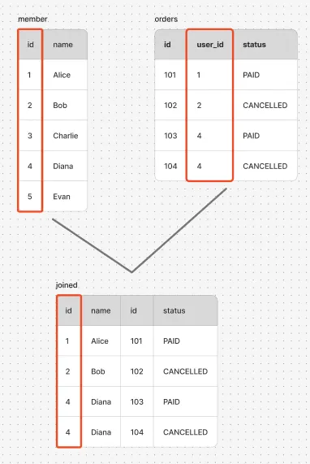
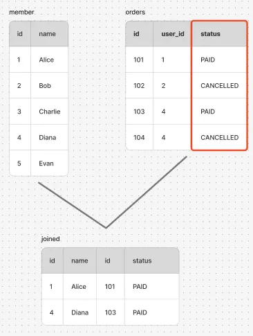
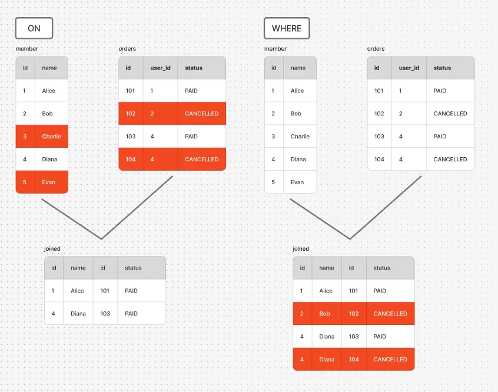
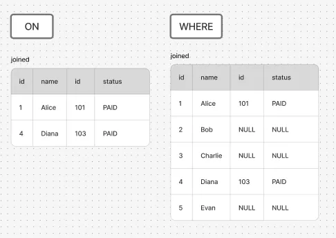
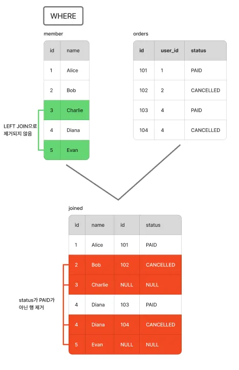
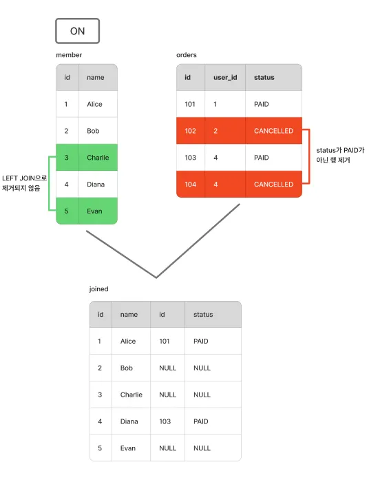
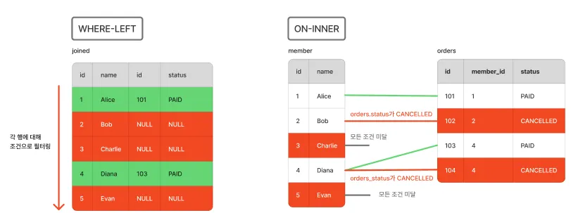

최근 QueryDSL을 사용해서 쿼리를 작성하다가,  
**“ON 절에 조인 목적이 아닌 조건을 넣어도 되는 건가?”** 라는 생각이 들었다.  
겉보기에는 잘 동작하지만,  
LEFT JOIN을 사용하는 순간 결과가 예상과 달라지는 경우가 있었다.  
이 글에서는 **ON 절과 WHERE 절의 차이가 실제로 어떤 동작 차이를 만드는지** 정리해본다.

## 일반적인 조인

일반적으로 ON 절은 테이블 조인 조건으로 사용된다.  
기본적인 예시로 아래 코드와 같이 각 테이블의 필드에 `=`을 사용하면 해당 필드가 겹쳐지면서 연결된다.

```sql
SELECT *
FROM member
INNER JOIN orders
ON orders.member_id = member.id
```



> 회원 id 3과 5는 orders에 없기 때문에 제거되었다.
> 

## 별도 조건 추가

그럼 여기서 두 테이블의 필드 외에 다른 조건도 넣어보자.

```sql
SELECT *
FROM member
JOIN orders
ON orders.member_id = member.id AND orders.status = 'PAID' # 주문 속성에서 PAID 상태인 것만 가져온다.
```



위 결과도 조인을 하는 데엔 문제가 없다.  
다만, 앞 예제와 다르게 orders의 status가 PAID가 아닌 행들은 조인되지 않는다.  

이렇게 필드 값의 조건에 따라 필터링 하는 기능은 대표적으로 WHERE 절의 특징이다.  
왜 WHERE절이 아닌 ON 절에서도 쓸 수 있는 것일까?

 

## WHERE절과 ON 절에서의 조건 차이

핵심은 ON 절은 **“조인 대상 선정”**이 목적이고,  
WHERE 절은 **“조인 결과 필터링”**이 목적이라는 점이다.



즉, 위 사진과 같이 ON 조건은 조인 과정에 참여할 행을 결정하고,  
WHERE 조건은 조인이 끝난 뒤 결과를 걸러낸다.  

아래는 위 이미지에 대한 SQL문으로,
WHERE 절에서 조건을 넣었을 때와 ON 절에서 조건을 넣었을 때 모습이다.

```sql
SELECT *
FROM member
INNER JOIN orders
  ON orders.member_id = member.id
WHERE orders.status = 'PAID'
```

```sql
SELECT *
FROM member
INNER JOIN orders
  ON orders.member_id = member.id AND orders.status = 'PAID'
```

> 위 사진과 같이 Inner Join을 사용했을 때 위 두 쿼리문의 결과는 동일하다.
그렇다면 문제가 없는 것일까?
> 

### OUTER 조인

앞 내용을 토대로 시점의 차이라는 것을 이해할 수 있다.  
그럼 이 시점이 어떨 때 문제가 되는 것일까?

```sql
SELECT *
FROM member
LEFT JOIN orders
  ON orders.member_id = member.id
WHERE orders.status = 'PAID'

SELECT *
FROM member
LEFT JOIN orders
  ON orders.member_id = member.id AND orders.status = 'PAID'
```



OUTER JOIN의 한 예시로 LEFT JOIN을 사용했을 때 두 결과는 다르다.

<aside>
💡

WHERE 절 사용 시

</aside>

1. Left Join을 사용하여 사용자의  id와 주문자의 id가 일치하면 조인한다.
    1. LEFT JOIN이기 때문에 member가 orders 안에 없더라도 조인된다.
2. 결과물에서 WHERE 절을 실행해 주문의 status 가 `PAID` 상태인 행만 남기고 모두 제거된다.



<aside>
💡

ON 절 사용 시

</aside>

1. Left Join을 사용하여 사용자의  id와 주문자의 id가 일치하면 조인한다.
    1. LEFT JOIN이기 때문에 member가 orders 안에 없더라도 조인된다
2. ON 절에 작성된 조건에 따라 주문의 status가 `PAID` 인 행만 조인한다.



### ON 절은 조건을 어떻게 검사하는가?

WHERE절은 하나의 테이블에 각 행마다 조건에 부합하는지 검사를 하는 반면,
ON절은 조건을 검사해야 하는 테이블이 2개이다.

SQL은 조인 방식에 따라 기준 테이블을 정하고, 
기준 테이블의 각 행에 대해 ON 조건을 만족하는 상대 테이블의 행과 연결 여부를 판단한다.
조건을 만족하는 상대 행이 없다면, OUTER JOIN의 경우 NULL로 채운 행이 연결된다.



위 사진에서는 member 테이블을 기준으로 조건을 검사한다.

1. member.id와 일치하는 orders.member_id 값을 가진 행이 존재하는가? 
2. 1번이 성립한다면 이 행들의 orders.status는 'PAID'인가?

위 조건을 통과한 상대 행들이 남아 JOIN을 처리하게 되는 것이다.

## 결론

정리하면, ON 절은 단순히 테이블을 연결하는 문법이 아니라  
**“어떤 행을 조인 대상으로 삼을지”**를 정의하는 조건이다.  
Inner Join 에서는 ON 과 WHERE의 차이가 드러나지 않지만,  
Left Join부터는 두 위치의 의미가 완전히 달라진다.  
이 차이를 이해하면, 조인 결과가 예상과 다르게 나오는 문제를 훨씬 쉽게 대처할 수 있다.

## 추가 내용

- 앞 이미지들은 PostgreSQL 에 직접 쿼리를 호출하여 만들어진 조인 결과를 기반으로 한다.
- 테이블 조인 결과 이미지에서 id, name, id, status 4개 필드만 보여지는데, 실제 PostgreSQL 기준으로 id, name, id, member_id, status 총 5가지가 보이는 것이 맞다.

예제 실행을 위해 실제 환경 또는 사이트에서 출력해볼 수 있다. 
https://sqlfiddle.com/postgresql/online-compiler?id=abb67416-dfd4-47ef-9db3-822c42f7a30c

```sql
CREATE TABLE member (
    id INT PRIMARY KEY,
    name VARCHAR(50)
);

CREATE TABLE orders (
    id INT PRIMARY KEY,
    member_id INT,
    status VARCHAR(20)
);

INSERT INTO member (id, name) VALUES
(1, 'Alice'),
(2, 'Bob'),
(3, 'Chris'),
(4, 'Diana'),
(5, 'Evan');

INSERT INTO orders (id, member_id, status) VALUES
(101, 1, 'PAID'),
(102, 2, 'CANCELLED'),
(103, 4, 'PAID'),
(104, 4, 'CANCELLED');

# ON 방식
SELECT *
FROM member m
LEFT JOIN orders o
  ON o.member_id = m.id
 AND o.status = 'PAID';
 
# WHERE 방식
 SELECT *
FROM member m
LEFT JOIN orders o
  ON o.member_id = m.id
WHERE o.status = 'PAID';

```